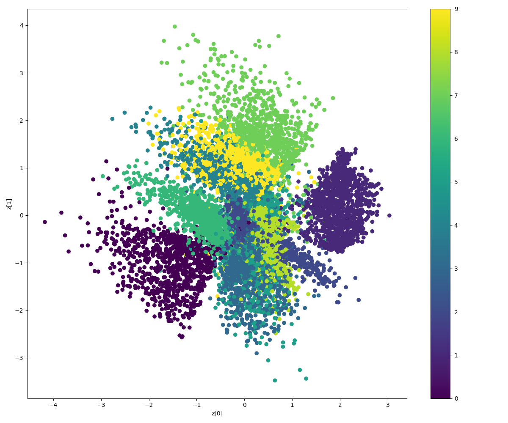
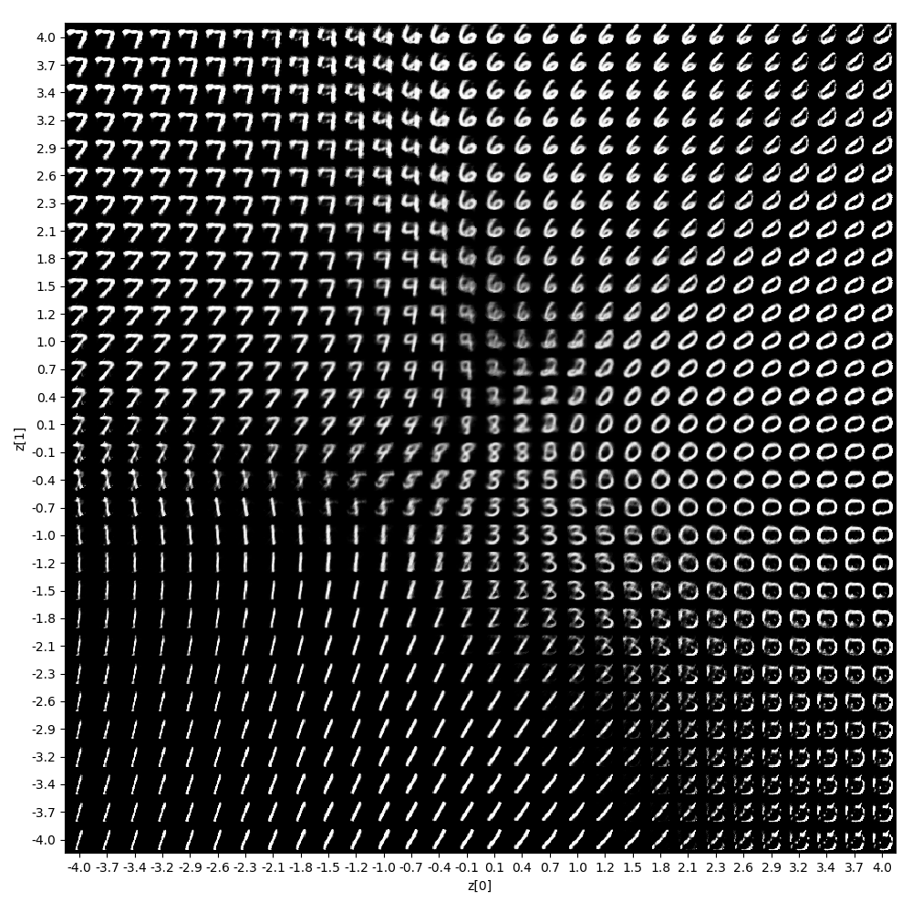

## Results
### Keras CPU
```
__________________________________________________________________________________________________
Layer (type)                    Output Shape         Param #     Connected to                     
==================================================================================================
input_1 (InputLayer)            (None, 784)          0                                            
__________________________________________________________________________________________________
dense_1 (Dense)                 (None, 512)          401920      input_1[0][0]                    
__________________________________________________________________________________________________
z_mean (Dense)                  (None, 2)            1026        dense_1[0][0]                    
__________________________________________________________________________________________________
z_variance (Dense)              (None, 2)            1026        dense_1[0][0]                    
__________________________________________________________________________________________________
z (Lambda)                      (None, 2)            0           z_mean[0][0]                     
                                                                 z_variance[0][0]                 
==================================================================================================
Total params: 403,972
Trainable params: 403,972
Non-trainable params: 0
__________________________________________________________________________________________________
_________________________________________________________________
Layer (type)                 Output Shape              Param #   
=================================================================
input_2 (InputLayer)         (None, 2)                 0         
_________________________________________________________________
dense_2 (Dense)              (None, 512)               1536      
_________________________________________________________________
dense_3 (Dense)              (None, 784)               402192    
=================================================================
Total params: 403,728
Trainable params: 403,728
Non-trainable params: 0
_________________________________________________________________
_________________________________________________________________
Layer (type)                 Output Shape              Param #   
=================================================================
input_1 (InputLayer)         (None, 784)               0         
_________________________________________________________________
encoder (Model)              [(None, 2), (None, 2), (N 403972    
_________________________________________________________________
decoder (Model)              (None, 784)               403728    
=================================================================
Total params: 807,700
Trainable params: 807,700
Non-trainable params: 0
_________________________________________________________________
Train on 60000 samples, validate on 10000 samples
Epoch 1/30
60000/60000 [==============================] - 8s 139us/step - loss: 49.1134 - val_loss: 44.6091
Epoch 2/30
60000/60000 [==============================] - 8s 139us/step - loss: 43.7734 - val_loss: 42.7430
Epoch 3/30
60000/60000 [==============================] - 8s 136us/step - loss: 42.3610 - val_loss: 41.7177
Epoch 4/30
60000/60000 [==============================] - 8s 136us/step - loss: 41.3106 - val_loss: 40.7987
Epoch 5/30
60000/60000 [==============================] - 8s 138us/step - loss: 40.5813 - val_loss: 40.3984
Epoch 6/30
60000/60000 [==============================] - 8s 138us/step - loss: 40.0702 - val_loss: 39.9225
Epoch 7/30
60000/60000 [==============================] - 8s 137us/step - loss: 39.7028 - val_loss: 39.4768
Epoch 8/30
60000/60000 [==============================] - 8s 137us/step - loss: 39.3810 - val_loss: 39.4279
Epoch 9/30
60000/60000 [==============================] - 8s 137us/step - loss: 39.0907 - val_loss: 39.0598
Epoch 10/30
60000/60000 [==============================] - 8s 139us/step - loss: 38.9051 - val_loss: 38.9444
Epoch 11/30
60000/60000 [==============================] - 8s 139us/step - loss: 38.6824 - val_loss: 38.8021
Epoch 12/30
60000/60000 [==============================] - 8s 140us/step - loss: 38.4897 - val_loss: 38.6424
Epoch 13/30
60000/60000 [==============================] - 8s 141us/step - loss: 38.3667 - val_loss: 38.4871
Epoch 14/30
60000/60000 [==============================] - 8s 141us/step - loss: 38.1887 - val_loss: 38.3946
Epoch 15/30
60000/60000 [==============================] - 9s 146us/step - loss: 38.0340 - val_loss: 38.5102
Epoch 16/30
60000/60000 [==============================] - 8s 141us/step - loss: 37.8937 - val_loss: 38.1952
Epoch 17/30
60000/60000 [==============================] - 9s 142us/step - loss: 37.8298 - val_loss: 38.0497
Epoch 18/30
60000/60000 [==============================] - 9s 145us/step - loss: 37.6871 - val_loss: 37.9632
Epoch 19/30
60000/60000 [==============================] - 9s 143us/step - loss: 37.6335 - val_loss: 37.9671
Epoch 20/30
60000/60000 [==============================] - 9s 143us/step - loss: 37.5000 - val_loss: 38.0477
Epoch 21/30
60000/60000 [==============================] - 9s 143us/step - loss: 37.4038 - val_loss: 37.8835
Epoch 22/30
60000/60000 [==============================] - 9s 142us/step - loss: 37.3189 - val_loss: 37.8105
Epoch 23/30
60000/60000 [==============================] - 9s 143us/step - loss: 37.2417 - val_loss: 37.7831
Epoch 24/30
60000/60000 [==============================] - 9s 144us/step - loss: 37.1690 - val_loss: 37.7516
Epoch 25/30
60000/60000 [==============================] - 9s 143us/step - loss: 37.0974 - val_loss: 37.6885
Epoch 26/30
60000/60000 [==============================] - 9s 143us/step - loss: 37.0310 - val_loss: 37.6980
Epoch 27/30
60000/60000 [==============================] - 9s 143us/step - loss: 36.9651 - val_loss: 37.5676
Epoch 28/30
60000/60000 [==============================] - 9s 144us/step - loss: 36.9002 - val_loss: 37.5065
Epoch 29/30
60000/60000 [==============================] - 9s 143us/step - loss: 36.8535 - val_loss: 37.5998
Epoch 30/30
60000/60000 [==============================] - 9s 143us/step - loss: 36.8108 - val_loss: 37.6155
```

### Tensorflow GPU
```
loss: 48.7781 / 43.9629	step 1  1.83 sec
loss: 43.0576 / 42.1581	step 2  3.39 sec
loss: 41.8477 / 41.4498	step 3  4.90 sec
loss: 41.1159 / 40.7394	step 4  6.42 sec
loss: 40.5461 / 40.1897	step 5  8.03 sec
loss: 40.0837 / 39.8244	step 6  9.60 sec
loss: 39.6981 / 39.4557	step 7  11.13 sec
loss: 39.3400 / 39.2951	step 8  12.70 sec
loss: 39.0901 / 38.9882	step 9  14.18 sec
loss: 38.8410 / 38.9238	step 10  15.63 sec
loss: 38.6069 / 38.6302	step 11  17.12 sec
loss: 38.4204 / 38.4315	step 12  18.57 sec
loss: 38.2586 / 38.4684	step 13  20.00 sec
loss: 38.1087 / 38.3495	step 14  21.43 sec
loss: 37.9735 / 38.1516	step 15  22.86 sec
loss: 37.8413 / 38.1394	step 16  24.31 sec
loss: 37.7303 / 38.0027	step 17  25.76 sec
loss: 37.6329 / 38.0624	step 18  27.21 sec
loss: 37.5593 / 37.8485	step 19  28.64 sec
loss: 37.4595 / 37.8364	step 20  30.10 sec
loss: 37.3831 / 37.8762	step 21  31.57 sec
loss: 37.3093 / 37.7988	step 22  33.05 sec
loss: 37.2419 / 37.7173	step 23  34.52 sec
loss: 37.1730 / 37.7223	step 24  35.95 sec
loss: 37.1225 / 37.7279	step 25  37.40 sec
loss: 37.0469 / 37.5681	step 26  38.85 sec
loss: 36.9953 / 37.6581	step 27  40.30 sec
loss: 36.9285 / 37.7773	step 28  41.75 sec
loss: 36.8653 / 37.5504	step 29  43.26 sec
loss: 36.8142 / 37.4639	step 30  44.70 sec
```



